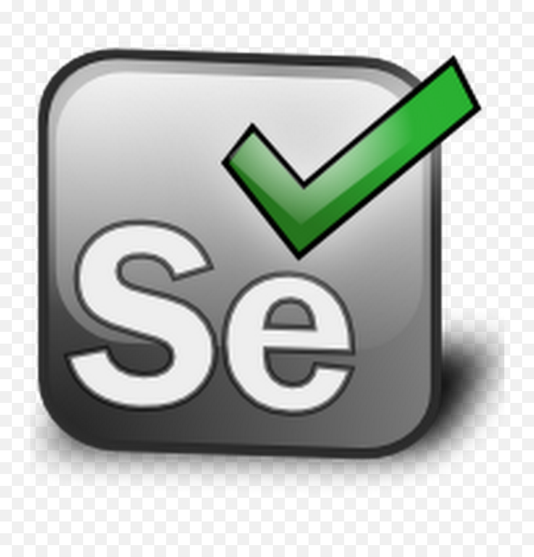

# Hi there, I'm Nazar - aka [Nazaroni][website] 👋

## I'm a Husband, Father, Developer, and Dreamer!!!

- 🌱 I’m currently improving my Rust skills. I found it very interesting and powerful language
- 👯 I’m looking to collaborate with other content creators and developers
- 🥅 2025 Goals: Contribute to my social network community
- I ❤️ Open Source
- I speak: :ukraine:, :us:, :de:, :poland:, and a little :fr:

### Connect with me:

[][website]
[][youtube]
[][twitter]
[][linkedin]

 

### Languages and Tools:

 
 

---

### 📺 Latest YouTube Videos

<!-- YOUTUBE:START -->

- [Rave First high-tech desk 🤯](https://youtu.be/hD-lNMkbV3M)
<!-- YOUTUBE:END -->

➡️ [more videos...](https://youtube.com/nazarmalyy)

---

### 📕 Latest Blog Posts

<!-- BLOG-POST-LIST:START -->

- [Docker in Docker](https://https://dev.to/nazaroni)

<!-- BLOG-POST-LIST:END -->

➡️ [more blog posts...](https://https://dev.to/nazaroni)

---

[website]: https://github.com/Nazaroni
[twitter]: https://twitter.com/Nazaroni
[youtube]: https://www.youtube.com/NazarMalyy
[instagram]: https://instagram.com/nazaroni
[linkedin]: https://linkedin.com/in/nazarmalyy
